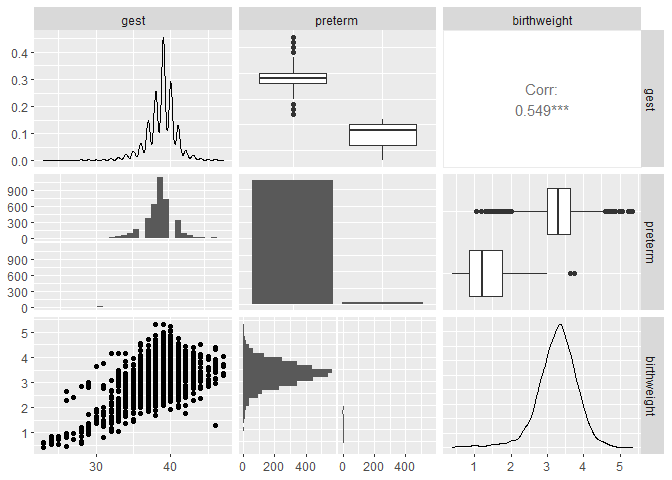

Visualizing the bayesian workflow in R
================
Nayef Ahmad
2022-03-21

-   [1 Overview](#overview)
-   [2 Libraries](#libraries)
-   [3 Reading in data](#reading-in-data)
    -   [3.1 Explanation of variables:](#explanation-of-variables)
-   [4 EDA](#eda)
    -   [4.1 Log transformation](#log-transformation)
    -   [4.2 Interaction between gestational age and
        preterm](#interaction-between-gestational-age-and-preterm)

# 1 Overview

References:

-   [Blog post by Monica
    Alexander](https://www.monicaalexander.com/posts/2020-28-02-bayes_viz/)

# 2 Libraries

``` r
library(tidyverse)
```

    ## Warning: package 'tidyverse' was built under R version 4.0.3

    ## -- Attaching packages --------------------------------------- tidyverse 1.3.0 --

    ## v ggplot2 3.3.5     v purrr   0.3.4
    ## v tibble  3.0.6     v dplyr   1.0.3
    ## v tidyr   1.1.2     v stringr 1.4.0
    ## v readr   1.4.0     v forcats 0.5.1

    ## Warning: package 'ggplot2' was built under R version 4.0.5

    ## Warning: package 'tibble' was built under R version 4.0.3

    ## Warning: package 'tidyr' was built under R version 4.0.3

    ## Warning: package 'readr' was built under R version 4.0.3

    ## Warning: package 'purrr' was built under R version 4.0.3

    ## Warning: package 'dplyr' was built under R version 4.0.3

    ## Warning: package 'stringr' was built under R version 4.0.3

    ## Warning: package 'forcats' was built under R version 4.0.3

    ## -- Conflicts ------------------------------------------ tidyverse_conflicts() --
    ## x dplyr::filter() masks stats::filter()
    ## x dplyr::lag()    masks stats::lag()

``` r
library(rstan)
```

    ## Loading required package: StanHeaders

    ## Warning: package 'StanHeaders' was built under R version 4.0.5

    ## rstan (Version 2.21.3, GitRev: 2e1f913d3ca3)

    ## For execution on a local, multicore CPU with excess RAM we recommend calling
    ## options(mc.cores = parallel::detectCores()).
    ## To avoid recompilation of unchanged Stan programs, we recommend calling
    ## rstan_options(auto_write = TRUE)

    ## Do not specify '-march=native' in 'LOCAL_CPPFLAGS' or a Makevars file

    ## 
    ## Attaching package: 'rstan'

    ## The following object is masked from 'package:tidyr':
    ## 
    ##     extract

``` r
library(brms)
```

    ## Warning: package 'brms' was built under R version 4.0.5

    ## Loading required package: Rcpp

    ## Warning: package 'Rcpp' was built under R version 4.0.3

    ## Loading 'brms' package (version 2.16.3). Useful instructions
    ## can be found by typing help('brms'). A more detailed introduction
    ## to the package is available through vignette('brms_overview').

    ## 
    ## Attaching package: 'brms'

    ## The following object is masked from 'package:rstan':
    ## 
    ##     loo

    ## The following object is masked from 'package:stats':
    ## 
    ##     ar

``` r
library(bayesplot)
```

    ## Warning: package 'bayesplot' was built under R version 4.0.5

    ## This is bayesplot version 1.8.1

    ## - Online documentation and vignettes at mc-stan.org/bayesplot

    ## - bayesplot theme set to bayesplot::theme_default()

    ##    * Does _not_ affect other ggplot2 plots

    ##    * See ?bayesplot_theme_set for details on theme setting

``` r
library(loo)
```

    ## Warning: package 'loo' was built under R version 4.0.5

    ## This is loo version 2.4.1

    ## - Online documentation and vignettes at mc-stan.org/loo

    ## - As of v2.0.0 loo defaults to 1 core but we recommend using as many as possible. Use the 'cores' argument or set options(mc.cores = NUM_CORES) for an entire session.

    ## - Windows 10 users: loo may be very slow if 'mc.cores' is set in your .Rprofile file (see https://github.com/stan-dev/loo/issues/94).

    ## 
    ## Attaching package: 'loo'

    ## The following object is masked from 'package:rstan':
    ## 
    ##     loo

``` r
library(tidybayes)
```

    ## Warning: package 'tidybayes' was built under R version 4.0.5

    ## 
    ## Attaching package: 'tidybayes'

    ## The following objects are masked from 'package:brms':
    ## 
    ##     dstudent_t, pstudent_t, qstudent_t, rstudent_t

``` r
library(here)
```

    ## Warning: package 'here' was built under R version 4.0.3

    ## here() starts at C:/Nayef/bayesian-stats-notes

``` r
library(GGally)
```

    ## Warning: package 'GGally' was built under R version 4.0.5

    ## Registered S3 method overwritten by 'GGally':
    ##   method from   
    ##   +.gg   ggplot2

# 3 Reading in data

``` r
ds <- read_rds(here::here("data", "births_2017_sample.RDS"))

ds <- 
  ds %>% 
  rename(birthweight = dbwt, 
         gest = combgest) %>% 
  mutate(preterm = ifelse(gest < 32, "Y", "N")) %>% 
  filter(ilive == "Y", 
         gest < 99, 
         birthweight < 9.999)

str(ds)
```

    ## tibble [3,840 x 9] (S3: tbl_df/tbl/data.frame)
    ##  $ mager      : num [1:3840] 21 19 35 27 27 19 28 22 29 29 ...
    ##  $ mracehisp  : num [1:3840] 7 7 4 1 2 3 7 1 7 2 ...
    ##  $ meduc      : num [1:3840] 3 3 6 4 2 3 6 3 2 3 ...
    ##  $ bmi        : num [1:3840] 21 46.3 19.6 26.6 22.2 18.8 30 37.1 22.3 30.7 ...
    ##  $ sex        : chr [1:3840] "F" "M" "M" "M" ...
    ##  $ gest       : num [1:3840] 40 39 39 40 37 40 40 39 37 38 ...
    ##  $ birthweight: num [1:3840] 3.53 3.64 2.86 4.37 2.61 ...
    ##  $ ilive      : chr [1:3840] "Y" "Y" "Y" "Y" ...
    ##  $ preterm    : chr [1:3840] "N" "N" "N" "N" ...

``` r
summary(ds)
```

    ##      mager         mracehisp         meduc           bmi       
    ##  Min.   :14.00   Min.   :1.000   Min.   :1.00   Min.   :15.60  
    ##  1st Qu.:25.00   1st Qu.:1.000   1st Qu.:3.00   1st Qu.:22.10  
    ##  Median :29.00   Median :1.000   Median :4.00   Median :25.50  
    ##  Mean   :28.85   Mean   :2.995   Mean   :4.39   Mean   :28.67  
    ##  3rd Qu.:33.00   3rd Qu.:7.000   3rd Qu.:6.00   3rd Qu.:30.70  
    ##  Max.   :50.00   Max.   :8.000   Max.   :9.00   Max.   :99.90  
    ##      sex                 gest        birthweight       ilive          
    ##  Length:3840        Min.   :23.00   Min.   :0.397   Length:3840       
    ##  Class :character   1st Qu.:38.00   1st Qu.:2.970   Class :character  
    ##  Mode  :character   Median :39.00   Median :3.310   Mode  :character  
    ##                     Mean   :38.64   Mean   :3.265                     
    ##                     3rd Qu.:40.00   3rd Qu.:3.623                     
    ##                     Max.   :47.00   Max.   :5.330                     
    ##    preterm         
    ##  Length:3840       
    ##  Class :character  
    ##  Mode  :character  
    ##                    
    ##                    
    ## 

``` r
head(ds)
```

    ## # A tibble: 6 x 9
    ##   mager mracehisp meduc   bmi sex    gest birthweight ilive preterm
    ##   <dbl>     <dbl> <dbl> <dbl> <chr> <dbl>       <dbl> <chr> <chr>  
    ## 1    21         7     3  21   F        40        3.53 Y     N      
    ## 2    19         7     3  46.3 M        39        3.64 Y     N      
    ## 3    35         4     6  19.6 M        39        2.86 Y     N      
    ## 4    27         1     4  26.6 M        40        4.37 Y     N      
    ## 5    27         2     2  22.2 M        37        2.61 Y     N      
    ## 6    19         3     3  18.8 M        40        2.86 Y     N

## 3.1 Explanation of variables:

1.  `gest` is gestational age in weeks. 40 weeks is considered normal.
2.  `birthweight` is birth weight in
3.  `preterm`

# 4 EDA

## 4.1 Log transformation

In the original post, modeling is done on the log scale. However, it’s
not totally clear to me that the log transformation yields a better fit.

``` r
ds %>% 
  ggplot(aes(x = gest, y = birthweight)) + 
  geom_point(alpha = .3) + 
  geom_smooth() + 
  geom_smooth(method = "lm", col = "red") + 
  labs(title = "birthweight vs gestational age")
```

    ## `geom_smooth()` using method = 'gam' and formula 'y ~ s(x, bs = "cs")'

    ## `geom_smooth()` using formula 'y ~ x'

<!-- -->

``` r
ds %>% 
  ggplot(aes(x = log(gest), y = log(birthweight))) + 
  geom_point(alpha = .3) + 
  geom_smooth() + 
  geom_smooth(method = "lm", col = "red") + 
  labs(title = "log(birthweight) vs log(gestational age)")
```

    ## `geom_smooth()` using method = 'gam' and formula 'y ~ s(x, bs = "cs")'

    ## `geom_smooth()` using formula 'y ~ x'

<!-- -->

## 4.2 Interaction between gestational age and preterm

``` r
ggpairs(ds[,c("birthweight", "gest", "preterm")])
```

    ## `stat_bin()` using `bins = 30`. Pick better value with `binwidth`.
    ## `stat_bin()` using `bins = 30`. Pick better value with `binwidth`.

<!-- -->
